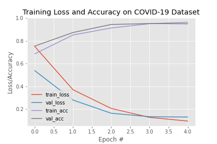

# Covid-19-CT-Scan-Classification
 Covid-19 classification model with 90% accuracy that uses Deep Learning to classify Covid-19 Patients from X-ray medical images.
 
## Dataset
The SARS-CoV-2 CT scan dataset available on kaggle from [here](www.kaggle.com/plameneduardo/sarscov2-ctscan-dataset) .

## Results
This is the final test results for the model on the SARS-CoV-2 CT scan dataset.

	
	 
	<em>plotting Accuracy and Loss.</em>

## Requirements
The main requirements are listed below:

* Tensorflow 2.7
* Python 3.9
* Numpy
* Matplotlib
